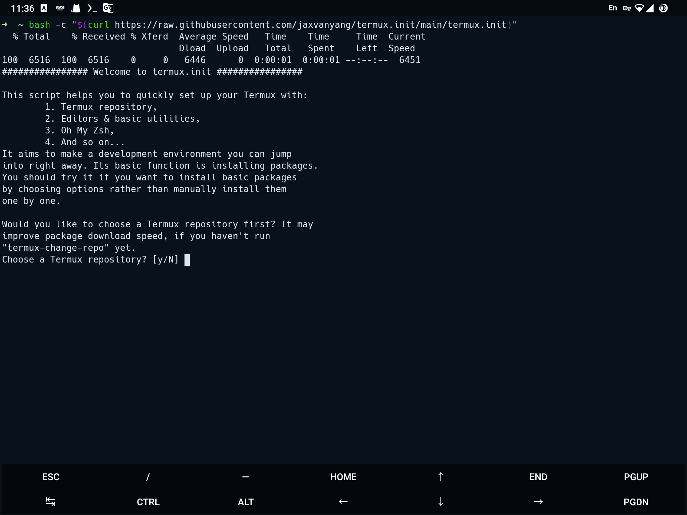

# termux.init

Set up your Termux on the fly.

## Usage

| Method | Command |
|---|---|
| Git | `git clone https://github.com/jaxvanyang/termux.init.git && termux.init/termux.init` |
| cURL | `bash -c "$(curl -fsSL https://raw.githubusercontent.com/jaxvanyang/termux.init/main/termux.init` |
| Wget | `bash -c "$(wget -O- https://raw.githubusercontent.com/jaxvanyang/termux.init/main/termux.init)"` |

## Features

- [x] Choose Termux repository.

- [x] Install editors & basic utilities.

- [x] Setup Oh My Zsh.

- [x] Setup OpenSSH.

- [x] Setup Git.

- [ ] Setup Termux API.
